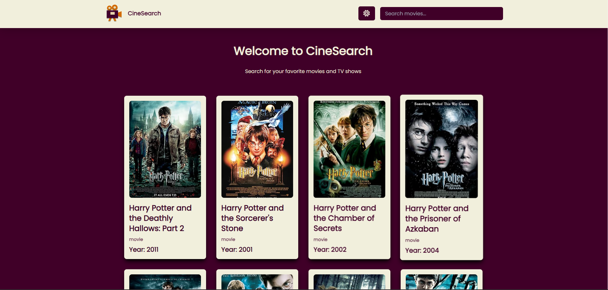

# cine-search

## Deployment

### [Deployed at Vercel 🔗](https://cine-search-three.vercel.app/)

## Preview



## Description

### This is a movie search app built using React and Tailwind CSS. It uses the [OMDB API](https://omdbapi.com/).

- You can see the list of movies in the home page.
- You can search for movies using the search bar.
- You can click on a movie to see more details about it.

### FYI

- Pagination is implemented.
- Error handling is implemented.
- The app is responsive.

## Local Setup

### 1. Clone the repo

```bash
git clone https://github.com/irahuldutta02/cine-search
cd cine-search
```

### 2. Install dependencies

```bash
npm install
```

### 3. Set up the .env

```bash
VITE_OMDB_API_KEY=<YOUR_KEY> # get it from [https://www.omdbapi.com/apikey.aspx]
```

### 4. Start the development server

```bash
npm run dev
```

## Technologies

### Tech Stack Used

- React
- Tailwind CSS
- React Router Dom

### Packages Used

- Axios
